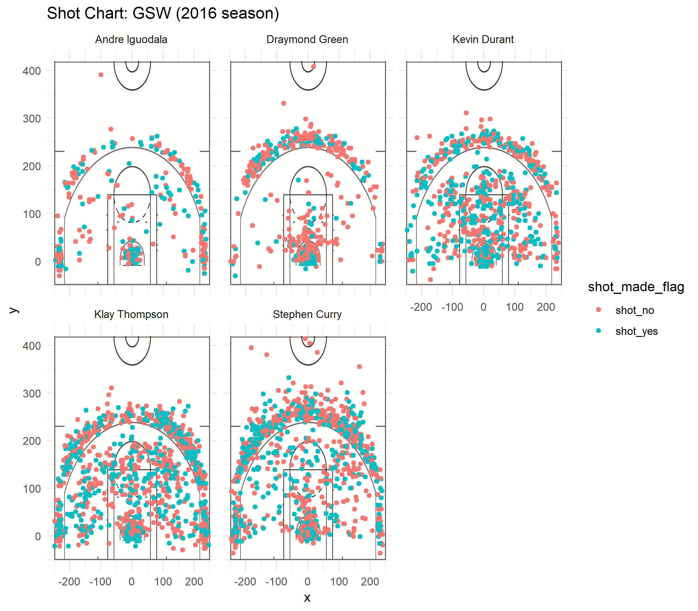

```{r setup, include=FALSE}
knitr::opts_chunk$set(echo = TRUE)
```

```{r}
library(ggplot2)
library(dplyr)
```

```{r}
all_five = read.csv("../data/shots-data.csv")
all_five$made = c(0, 1)[(all_five$shot_made_flag=="shot_yes") + 1L]
```

## 2PT Effective Shooting % by Player 

```{r echo=FALSE}
two_percent = all_five %>% 
                  filter(shot_type == "2PT Field Goal") %>%
                  group_by(name) %>% 
                  summarize(total=length(made), made=sum(made)) %>%
                  mutate(perc_made = made/total) %>%
                  arrange(desc(perc_made))
two_percent
``` 


## 3PT Effective Shooting % by Player

```{r echo=FALSE}
three_percent = all_five %>% 
                  filter(shot_type == "3PT Field Goal") %>%
                  group_by(name) %>% 
                  summarize(total=length(made), made=sum(made)) %>%
                  mutate(perc_made = made/total) %>%
                  arrange(desc(perc_made))
three_percent
``` 


## Effective Shooting % by Player

```{r echo=FALSE}
total_percent = all_five %>% 
                  group_by(name) %>% 
                  summarize(total=length(made), made=sum(made)) %>%
                  mutate(perc_made = made/total) %>%
                  arrange(desc(perc_made))
total_percent
```


# Article: Why Andre Iguodala should be the new star of the Warriors' offense


### Introduction

Every sport has moments that revolutionize how it is played. For high jump, it was when Dick Fosbury introduced the Fobsbury Flop, jumping backwards over the bar instead of staying upright, and almost instantaneously showing the world a new and better approach to the high jump. In this article, I intend to do something similar for basketball. Right now, basketball is dominated by long-range shooters. Players like Steph Curry, who consistently score 3-point shots, are given as many opportunities to do so as possible by their teammates because those shots are worth more than 2-pointers, and Steph (and similar players) can make them. I will argue that the optimal way to play is in fact to open up as many opportunities as possible for short-range shooters like Andre Iguoala, who is more commonly known as Iggy. 


### Background

There is little background for this article. I do not know much about the nuances of basketball, and I am reasonably certain an idea like this has not been suggested in earnest before, as is being done here. Nevertheless, I believe this theory could be fruitfully put to use, in part because it is so different from how the game is currentl played that other teams would be caught by suprise. 


### Data 

The data this article is based on consists of information from the 2016 season about all of the shots taken by 5 players from the Golden State Warriors: Stephen Curry, Kevin Durant, Andre Iguodala, Klay Thompson, and Draymond Green. It was collected by me from the Github repository of UC Berkeley's Statistics 133 course. I do not know how the data was originally gathered/collected from. Generally, sample sizes of 5 are on the small side for producing statistically significant results. However, in this case, because there is data for 5 players, and basketball allows for exactly 5 players per team to be on the court, it is the opinion of the author that this sample size is perfect. 


### Analysis

The analysis supporting this claim will primarily be based on tables showing shooting averages for each of the five players, from within the 3-point line, outside the 3-point line, and for all shots. These tables can be seen below:

```{r echo=FALSE}
all_five = read.csv("../data/shots-data.csv")
all_five$made = c(0, 1)[(all_five$shot_made_flag=="shot_yes") + 1L]
```

##### 2PT Effective Shooting % by Player 

```{r echo=FALSE}
two_percent = all_five %>% 
                  filter(shot_type == "2PT Field Goal") %>%
                  group_by(name) %>% 
                  summarize(total=length(made), made=sum(made)) %>%
                  mutate(perc_made = made/total) %>%
                  arrange(desc(perc_made))
two_percent
``` 


##### 3PT Effective Shooting % by Player

```{r echo=FALSE}
three_percent = all_five %>% 
                  filter(shot_type == "3PT Field Goal") %>%
                  group_by(name) %>% 
                  summarize(total=length(made), made=sum(made)) %>%
                  mutate(perc_made = made/total) %>%
                  arrange(desc(perc_made))
three_percent
``` 


##### Effective Shooting % by Player

```{r echo=FALSE}
total_percent = all_five %>% 
                  group_by(name) %>% 
                  summarize(total=length(made), made=sum(made)) %>%
                  mutate(perc_made = made/total) %>%
                  arrange(desc(perc_made))
total_percent
```


```{r out.width="80%", echo=FALSE, fig.align="center"}

```


