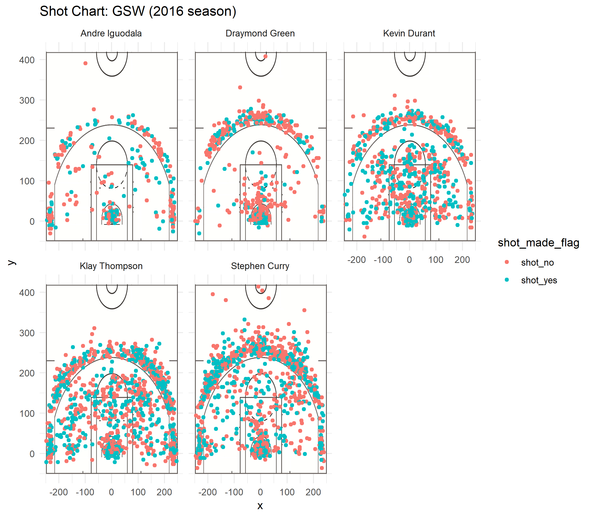

Why Andre Iguodala should be the new star of the Warriors' offense
==================================================================

### Introduction

Every sport has moments that revolutionize how it is played. For high
jump, it was when Dick Fosbury introduced the Fobsbury Flop, jumping
backwards over the bar instead of staying upright, and almost
instantaneously showing the world a new and better approach to the high
jump. In this article, I intend to do something similar for basketball.
Right now, basketball is dominated by long-range shooters. Players like
Steph Curry, who consistently score 3-point shots, are given as many
opportunities to do so as possible by their teammates because those
shots are worth more than 2-pointers, and Steph (and similar players)
can make them. I will argue that the optimal way to play is in fact to
open up as many opportunities as possible for short-range shooters like
Andre Iguoala, who is more commonly known as Iggy.

### Background

There is little background for this article. I do not know much about
the nuances of basketball, and I am reasonably certain an idea like this
has not been suggested in earnest before, as is being done here.
Nevertheless, I believe this theory could be fruitfully put to use, in
part because it is so different from how the game is currentl played
that other teams would be caught by suprise.

### Data

The data this article is based on consists of information from the 2016
season about all of the shots taken by 5 players from the Golden State
Warriors: Stephen Curry, Kevin Durant, Andre Iguodala, Klay Thompson,
and Draymond Green. It was collected by me from the Github repository of
UC Berkeley's Statistics 133 course. I do not know how the data was
originally gathered/collected from. Generally, sample sizes of 5 are on
the small side for producing statistically significant results. However,
in this case, because there is data for 5 players, and basketball allows
for exactly 5 players per team to be on the court, it is the opinion of
the author that this sample size is perfect.

An example of the data table used can be seen here:

<table>
<thead>
<tr class="header">
<th align="right">X</th>
<th align="left">team_name</th>
<th align="left">game_date</th>
<th align="right">season</th>
<th align="right">period</th>
<th align="right">minutes_remaining</th>
<th align="right">seconds_remaining</th>
<th align="left">shot_made_flag</th>
<th align="left">action_type</th>
<th align="left">shot_type</th>
<th align="right">shot_distance</th>
<th align="left">opponent</th>
<th align="right">x</th>
<th align="right">y</th>
<th align="left">name</th>
<th align="right">minute</th>
<th align="right">made</th>
</tr>
</thead>
<tbody>
<tr class="odd">
<td align="right">1</td>
<td align="left">Golden State Warriors</td>
<td align="left">12/15/16</td>
<td align="right">2016</td>
<td align="right">3</td>
<td align="right">3</td>
<td align="right">51</td>
<td align="left">shot_yes</td>
<td align="left">Cutting Finger Roll Layup Shot</td>
<td align="left">2PT Field Goal</td>
<td align="right">3</td>
<td align="left">New York Knicks</td>
<td align="right">25</td>
<td align="right">21</td>
<td align="left">Stephen Curry</td>
<td align="right">33</td>
<td align="right">1</td>
</tr>
<tr class="even">
<td align="right">2</td>
<td align="left">Golden State Warriors</td>
<td align="left">10/28/16</td>
<td align="right">2016</td>
<td align="right">3</td>
<td align="right">9</td>
<td align="right">14</td>
<td align="left">shot_yes</td>
<td align="left">Cutting Finger Roll Layup Shot</td>
<td align="left">2PT Field Goal</td>
<td align="right">2</td>
<td align="left">New Orleans Pelicans</td>
<td align="right">9</td>
<td align="right">26</td>
<td align="left">Stephen Curry</td>
<td align="right">27</td>
<td align="right">1</td>
</tr>
<tr class="odd">
<td align="right">3</td>
<td align="left">Golden State Warriors</td>
<td align="left">11/1/16</td>
<td align="right">2016</td>
<td align="right">2</td>
<td align="right">5</td>
<td align="right">8</td>
<td align="left">shot_yes</td>
<td align="left">Cutting Finger Roll Layup Shot</td>
<td align="left">2PT Field Goal</td>
<td align="right">2</td>
<td align="left">Portland Trail Blazers</td>
<td align="right">-22</td>
<td align="right">2</td>
<td align="left">Stephen Curry</td>
<td align="right">19</td>
<td align="right">1</td>
</tr>
<tr class="even">
<td align="right">4</td>
<td align="left">Golden State Warriors</td>
<td align="left">12/1/16</td>
<td align="right">2016</td>
<td align="right">3</td>
<td align="right">5</td>
<td align="right">27</td>
<td align="left">shot_yes</td>
<td align="left">Cutting Finger Roll Layup Shot</td>
<td align="left">2PT Field Goal</td>
<td align="right">0</td>
<td align="left">Houston Rockets</td>
<td align="right">2</td>
<td align="right">7</td>
<td align="left">Stephen Curry</td>
<td align="right">31</td>
<td align="right">1</td>
</tr>
<tr class="odd">
<td align="right">5</td>
<td align="left">Golden State Warriors</td>
<td align="left">4/4/17</td>
<td align="right">2016</td>
<td align="right">3</td>
<td align="right">2</td>
<td align="right">4</td>
<td align="left">shot_yes</td>
<td align="left">Cutting Finger Roll Layup Shot</td>
<td align="left">2PT Field Goal</td>
<td align="right">2</td>
<td align="left">Minnesota Timberwolves</td>
<td align="right">1</td>
<td align="right">26</td>
<td align="left">Stephen Curry</td>
<td align="right">34</td>
<td align="right">1</td>
</tr>
<tr class="even">
<td align="right">6</td>
<td align="left">Golden State Warriors</td>
<td align="left">11/19/16</td>
<td align="right">2016</td>
<td align="right">4</td>
<td align="right">5</td>
<td align="right">36</td>
<td align="left">shot_yes</td>
<td align="left">Cutting Finger Roll Layup Shot</td>
<td align="left">2PT Field Goal</td>
<td align="right">0</td>
<td align="left">Milwaukee Bucks</td>
<td align="right">2</td>
<td align="right">7</td>
<td align="left">Stephen Curry</td>
<td align="right">43</td>
<td align="right">1</td>
</tr>
</tbody>
</table>

### Analysis

The analysis supporting this claim will primarily be based on tables
showing shooting averages for each of the five players, from within the
3-point line, outside the 3-point line, and for all shots. These tables
can be seen below:

##### 2PT Effective Shooting % by Player

<table>
<thead>
<tr class="header">
<th align="left">name</th>
<th align="right">total</th>
<th align="right">made</th>
<th align="right">perc_made</th>
</tr>
</thead>
<tbody>
<tr class="odd">
<td align="left">Andre Iguodala</td>
<td align="right">210</td>
<td align="right">134</td>
<td align="right">0.6380952</td>
</tr>
<tr class="even">
<td align="left">Kevin Durant</td>
<td align="right">643</td>
<td align="right">390</td>
<td align="right">0.6065319</td>
</tr>
<tr class="odd">
<td align="left">Stephen Curry</td>
<td align="right">563</td>
<td align="right">304</td>
<td align="right">0.5399645</td>
</tr>
<tr class="even">
<td align="left">Klay Thompson</td>
<td align="right">640</td>
<td align="right">329</td>
<td align="right">0.5140625</td>
</tr>
<tr class="odd">
<td align="left">Draymond Green</td>
<td align="right">346</td>
<td align="right">171</td>
<td align="right">0.4942197</td>
</tr>
</tbody>
</table>

##### 3PT Effective Shooting % by Player

<table>
<thead>
<tr class="header">
<th align="left">name</th>
<th align="right">total</th>
<th align="right">made</th>
<th align="right">perc_made</th>
</tr>
</thead>
<tbody>
<tr class="odd">
<td align="left">Klay Thompson</td>
<td align="right">580</td>
<td align="right">246</td>
<td align="right">0.4241379</td>
</tr>
<tr class="even">
<td align="left">Stephen Curry</td>
<td align="right">687</td>
<td align="right">280</td>
<td align="right">0.4075691</td>
</tr>
<tr class="odd">
<td align="left">Kevin Durant</td>
<td align="right">272</td>
<td align="right">105</td>
<td align="right">0.3860294</td>
</tr>
<tr class="even">
<td align="left">Andre Iguodala</td>
<td align="right">161</td>
<td align="right">58</td>
<td align="right">0.3602484</td>
</tr>
<tr class="odd">
<td align="left">Draymond Green</td>
<td align="right">232</td>
<td align="right">74</td>
<td align="right">0.3189655</td>
</tr>
</tbody>
</table>

##### Effective Shooting % by Player

<table>
<thead>
<tr class="header">
<th align="left">name</th>
<th align="right">total</th>
<th align="right">made</th>
<th align="right">perc_made</th>
</tr>
</thead>
<tbody>
<tr class="odd">
<td align="left">Kevin Durant</td>
<td align="right">915</td>
<td align="right">495</td>
<td align="right">0.5409836</td>
</tr>
<tr class="even">
<td align="left">Andre Iguodala</td>
<td align="right">371</td>
<td align="right">192</td>
<td align="right">0.5175202</td>
</tr>
<tr class="odd">
<td align="left">Klay Thompson</td>
<td align="right">1220</td>
<td align="right">575</td>
<td align="right">0.4713115</td>
</tr>
<tr class="even">
<td align="left">Stephen Curry</td>
<td align="right">1250</td>
<td align="right">584</td>
<td align="right">0.4672000</td>
</tr>
<tr class="odd">
<td align="left">Draymond Green</td>
<td align="right">578</td>
<td align="right">245</td>
<td align="right">0.4238754</td>
</tr>
</tbody>
</table>

As mentioned in the introduction, currently players like Klay Thompson
and Stephen Curry score the majority of the points, and many of those
points are the result of 3-point shots. However, I will now demonstrated
that this is a suboptimal method of scoring points.

To begin with, observe Stephen Curry. He scores roughly 54% of his
2-point shots, and roughly 40% of his 3-point shots. Since the 3-point
shots are worth 50% more than the 2-point shots, the value of Stephen
Curry's 3-point shots seems to be higher than the value of his 2-point
shots. So, if Curry is shooting, he should be shooting 3-pointers
instead of 2-pointers.

However, now observe the best overall shooter in the dataset, Kevin
Durant. Durant scores roughly 60% of his 2-point shots and roughly 39%
of his 3-point shots. Using the same logic as was used for Stephen
Curry, the value of Kevin Durant's 3-point shots is slightly lower than
that of his 2-point shots, since even 39 \* 1.5 is less than 60. So, if
Kevin Durant has the ball, it is better for him to be shotting
2-pointers instead of 3-pointers.

Finally, compare the best 2-point shooter and the best 3-point shooter
in the dataset. Andre Iguodala, the best 2-point shooter, makes roughly
64% of his 2-point shots, whereas Klay Thompson, the best 3-point
shooter, makes roughly 42% of his 3-point shots. Using the same
conversion as before, we can see that even with the conversion, it's
more valuable for Andre Iguodala to shoot a 2-pointer than it is for
Klay Thompson to shot a 3-pointer, since 42 \* 1.5 is less than 64.
Moreover, since Klay Thompson is the best 3-point shooter, if Andre
Iguodala's 2-point shot is more valuable than Klay Thompson's 3-point
shot, then it must be more valuable than the 3-point shots for any
player in the dataset. Thus, the optimal way for the team to play would
be for every shot to be a 2-point shot made by Andre Iguodala.

While it doesn't provide further mathematical evidence for this
conclusion, the following image, which shows the shots made by each
player, similarly shows that Andre Iguodala makes a much higher
percentage of his shots from within the 3-point line than any of the 5
players makes from outside the line.

##### Conclusion

In short, based on the data here, it seems that the ideal way for the
Golden State Warriors to play would be for the only shots made by the
team as a whole to by 2-point shots made by Andre Iguodala, since that
would maximize the expected number of points gained by each shot. This
result has potentially far-reaching conclusions, because as of now many
of the shots taken are 3-pointers, and not by Andre Iguodala. While not
every team can have all their shots be taken by Andre Iguodala, they
could transition to shooting only 2-pointers. This would be a revolution
in the way basketball is played, paving the way for a host of new
strategies and techniques.
